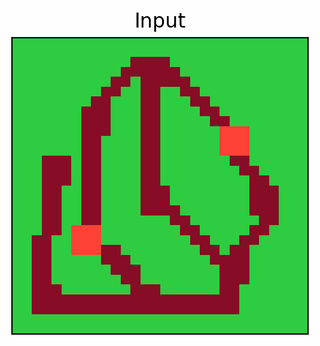

# Denoising Recursion Models

This is the official repository for the paper [One Step Forward and K Steps Back: Better Reasoning with Denoising Recursion Models](https://arxiv.org/abs/2604.18839). This repository builds on the [TRM repository](https://github.com/SamsungSAILMontreal/TinyRecursiveModels).

We introduce Denoising Recursion Models, an iterative-refinement method that corrupts data with noise as in diffusion, but trains the model to reverse the corruption over multiple recursive steps as in recursion models. This strategy provides a tractable curriculum of intermediate states while better aligning training with testing and incentivizing non-greedy, forward-looking generation. We show that this approach outperforms the Tiny Recursion Model (TRM) on ARC-AGI, where it recently achieved breakthrough performance.




### Requirements
- Python 3.10 (or similar)
- CUDA 12.6.0 (or similar)

```bash
pip install --upgrade pip wheel setuptools
pip install --pre --upgrade torch torchvision torchaudio --index-url https://download.pytorch.org/whl/nightly/cu126 # install torch based on your cuda version
pip install -r requirements.txt # install requirements
pip install --verbose --no-cache-dir --no-build-isolation adam-atan2
wandb login YOUR-LOGIN # login if you want the logger to sync results to your Weights & Biases (https://wandb.ai/)
```

### Dataset Preparation

Run the following to build datasets with augmentations for ARC-AGI-1 and 2.
```bash
# ARC-AGI-1
python -m dataset.build_arc_dataset \
  --input-file-prefix kaggle/combined/arc-agi \
  --output-dir data/arc1concept-aug-1000 \
  --subsets training evaluation concept \
  --test-set-name evaluation

# ARC-AGI-2
python -m dataset.build_arc_dataset \
  --input-file-prefix kaggle/combined/arc-agi \
  --output-dir data/arc2concept-aug-1000 \
  --subsets training2 evaluation2 concept \
  --test-set-name evaluation2
```

### Execution
To run an experiment, create two configuration files: (1) one for training settings (e.g., batch size, learning rate) in `configs/`, and (2) one for architecture settings (e.g., number of loops, embedding size) in `configs/arch/`. For example, with the training config `configs/cfg_pretrain.py` and architecture config `configs/arch/drm_7m.py`, you can run an experiment as follows:

```
run_name="test"
torchrun --nproc-per-node 1 --rdzv_backend=c10d --rdzv_endpoint=localhost:0 --nnodes=1 \
pretrain.py --config-name cfg_pretrain arch=drm_7m \
```
Specify the number of GPUs with `--nproc-per-node`. Training config parameters can be overridden with `[param_name]=[value]`, and architecture parameters can be overridden with `arch.[param_name]=[value]`.

To reproduce results for our ARC-AGI-2 experiments with training config `configs/cfg_pretrain.py`, choose one of the six architecture settings in `configs/arch/`: `trm_7m`, `trm_14m`, `sprm_7m`, `sprm_14m`, `drm_7m`, or `drm_14m`. These correspond to the method (TRM, SPRM, or DRM) and model size (7M or 14M parameters).

### Evaluation Visualization

Trajectory saving is off by default because it can slow evaluation noticeably, especially on ARC where selected/debug modes spool intermediate candidates before voting.

If you want saved visualization outputs, add the setting below to your training config in `configs/`, for example `configs/cfg_pretrain.yaml`. Do not put it in an architecture config under `configs/arch/`.

```yaml
eval_trajectory_mode: selected
```

Allowed values:

- `off`: save no trajectory visualizations.
- `selected`: save the trajectory corresponding to the final ARC prediction selected by voting. This is the recommended mode when you want viewer output.
- `all`: save every trajectory from every augmentation for every evaluated task. This can use significant disk space and be substantially slower.
- `debug`: save `selected.json` plus `debug.json`, where `debug.json` contains failed ARC cases where voting chose the wrong final prediction even though some trajectory became correct at an intermediate step.

Saved diagnostics are written directly as JSON files at `results/<experiment_name>/step_<STEP>/trajectories/`.

### How To Inspect Saved Trajectories

There is a browser-based inspection tool in this repo:

```text
drm_diagnostics_viewer_arc2.html
```

Use this as the main way to inspect saved ARC trajectories. Open `drm_diagnostics_viewer_arc2.html` in a browser and load the saved diagnostics JSON directly.

### Where Results Are Saved

Evaluation outputs are written under:

```text
results/<run_name>/step_<STEP>/
```

where `<STEP>` is the training step of the checkpoint being evaluated.

The most important files are:

- `results/<experiment_name>/step_<STEP>/trajectories/selected.json`
  This is the main saved visualization output for ARC. It contains one saved trajectory per ARC test input, corresponding to the prediction chosen by voting.
- `results/<experiment_name>/step_<STEP>/trajectories/debug.json`
  Only written in `debug` mode. This contains especially informative ARC failure cases.
- `results/<experiment_name>/step_<STEP>/trajectories/all.json`
  Only written in `all` mode. This contains every saved trajectory and can be large.
- `results/<experiment_name>/step_<STEP>/evaluators/ARC/submission.json`
  The ARC submission file produced after voting.

If you also enable raw tensor dumps with `eval_save_outputs`, they are written to:

```text
results/<experiment_name>/step_<STEP>/predictions/all_preds.pt
```

This raw tensor file is mainly for debugging. The most important high-level entries are:

- `inputs`: the input grids shown to the model.
- `labels`: the target output grids.
- `puzzle_identifiers`: which ARC task each example belongs to.
- `preds`: the model predictions that were saved.

The trajectory files are usually more useful for visualization. They contain high-level per-example information such as:

- `inputs`: the input grid.
- `labels`: the ground-truth output grid.
- `puzzle_identifier`: which ARC task this example came from.
- `predictions`: the sequence of predicted grids across recursion / denoising steps.
- `q_halt_probs`: the model's internal probability of correctness across steps.

### Paper Reproduction

The current codebase is a refactored setup that joins TRM, SPRM, and DRM into a shared framework.

If you want to run the exact codepath used for the experiments reported in the paper, use the legacy implementation instead:

- `legacy/`
- `configs/legacy/`
- `models/recursive_reasoning/legacy/`

### Citation

If you use this repository, please cite:

```bibtex
@article{cameron2026onestepforward,
  title={One Step Forward and K Steps Back: Better Reasoning with Denoising Recursion Models},
  author={Cameron, Chris and Wang, Wangzheng and Ivanov, Nikita and Bhattacharyya, Ashmita and Ch{\'e}telat, Didier and Zhang, Yingxue},
  journal={arXiv preprint arXiv:2604.18839},
  year={2026},
  doi={10.48550/arXiv.2604.18839}
}
```
